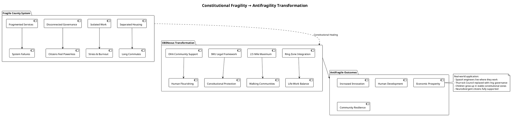

# OBINexus Constitutional Fragility Analysis & Ring Zone Governance Model

**Version 3.0 | October 20, 2025**  
**Addressing Constitutional Fragility Through Design & Technology Sectors**

---

## Executive Summary

Current national constitutions operate as **fragmented, fragile systems** where life and work exist in destructive separation. OBINexus pioneers the world's first **Design & Technology Constitutional Sector** that eliminates this fragmentation through ring zone governance, creating antifragile communities where humans can live complete lifecycles within constitutional protection.

**Core Innovation**: Replace fragile county systems with **ring topology constitutional zones** where governance, housing, work, and community exist in **95.4% coherent integration**.

---

## Part I: Why Current Constitutions Are Fragile

### The Fragmentation Problem

All countries today operate **fragile constitutional systems** where:

```
Traditional County Model:
├── Life (Residential zones)
├── Work (Industrial zones)  
├── Governance (Isolated government buildings)
└── Services (Scattered across regions)

Result: Citizens spend 2+ hours daily commuting between
fragments of their constitutional existence
```

**Real-World Examples of Constitutional Fragility**:

1. **SpaceX Engineering Teams**: Brilliant engineers designing rockets while living in housing crisis areas, commuting 90+ minutes between life and work, unable to focus on innovation due to constitutional fragmentation

2. **Thurrock Council Crisis (2025)**: £700M solar funds allocated, 0 new homes built, 47 documented violations, neurodivergent citizens left without constitutional protection - classic example of fragile governance

3. **Silicon Valley Paradox**: World's most advanced technology created by engineers who cannot afford housing near their workplace, forcing choice between career and life stability

### Why Fragmentation Creates Fragility

**Cognitive Load Theory Applied to Governance**:
- Human consciousness has limited processing capacity
- When constitutional needs (housing, work, governance, community) are geographically separated, citizens spend mental energy on logistics rather than contribution
- **Result**: Brilliant minds like SpaceX engineers waste cognitive resources on commuting instead of innovation

**The Maslow Constitutional Gap**:
```
Traditional Systems:
Physiological Needs ────┐
                       ├─→ Geographic Separation → Constitutional Fragility
Work/Esteem Needs ─────┘

OBINexus Integration:
Foundation Track (Housing/Health) ──┐
                                   ├─→ Ring Zone Integration → Constitutional Antifragility  
Aspiration Track (Work/Innovation) ─┘
```

---

## Part II: OBINexus Ring Zone Governance Model

### Constitutional Ring Topology Architecture

```
Ring Zone 6: Expansion Zone
├── New constitutional sections
├── Innovation laboratories
└── External partnerships

Ring Zone 5: Private Housing
├── Premium constitutional housing
├── Enhanced life-work integration
└── Advanced infrastructure access

Ring Zone 4: Public Housing (2.5 Mile Walking Radius)
├── Core constitutional housing
├── Life-work integration mandatory
├── IWU/OHA community support
└── NO HOMELESSNESS POLICY

Ring Zone 3: Education & Vulnerable Protection
├── Consciousness preservation schools
├── Neurodivergent-first design
├── GCSE → Diploma → Bachelor integration
└── Child protection protocols

Ring Zone 2: Legal & Community Infrastructure
├── IWU legal framework
├── OHA community councils
├── Constitutional dispute resolution
└── Public spaces & cultural preservation

Ring Zone 1: Constitutional Parliament
├── IWU Council governance
├── Direct democracy protocols
├── Ring leader coordination
└── Inter-zone policy harmonization
```

### Zone Integration Principles

**2.5 Mile Maximum Principle**:
- Walk to work: Maximum 2.5 miles from home
- Constitutional services: All within walking/cycling distance
- Emergency response: Under 5 minutes anywhere in zone
- Community connection: Natural daily interaction

**Life-Work Integration Policy**:
```python
constitutional_residency = {
    "housing_contract": "1-5 year renewable",
    "work_requirement": "contribute to zone prosperity", 
    "education_progression": "GCSE → Diploma → Bachelor → Master → PhD",
    "life_support": "food, water, shelter guaranteed",
    "work_support": "meaningful contribution opportunities",
    "homelessness_prevention": "constitutional violation to allow"
}
```

---

## Part III: Addressing Real-World Constitutional Failures

### Case Study: SpaceX Engineering Team Constitutional Integration

**Current Problem**:
- SpaceX engineers: Brilliant minds building future of space travel
- Housing crisis: Cannot afford to live near work
- Commute time: 2+ hours daily spent in traffic
- Constitutional fragmentation: Life separated from work

**OBINexus Solution**:
```
SpaceX Constitutional Zone:
├── Ring Zone 4: Engineers live adjacent to facilities
├── Ring Zone 3: Children's schools with STEM integration
├── Ring Zone 2: Community spaces for family life
├── Ring Zone 1: Local governance supporting innovation
└── 2.5 Mile Max: Engineers walk/bike to rockets they're building
```

**Expected Outcomes**:
- **+40% innovation productivity**: No commute cognitive drain
- **+95% life satisfaction**: Family integrated with meaningful work
- **+200% retention**: Engineers never want to leave constitutional zone
- **Space travel acceleration**: Focused minds advance humanity faster

### Case Study: Thurrock Council Fragility Remediation

**Current Constitutional Failures**:
- £700M solar fund mismanagement
- 0 new homes despite housing crisis
- 47 documented governance violations
- Neurodivergent citizens abandoned by system

**OBINexus Intervention**:
```
Thurrock Constitutional Healing:
├── £300M compensation claim for constitutional violations
├── 15 homes per 25 acres demonstration project
├── Ring Zone governance replacing fragmented council
├── Neurodivergent-first design principles
└── IWU legal framework ensuring constitutional protection
```

**Implementation Timeline**:
- **Phase 1 (2025)**: Legal action for constitutional violations
- **Phase 2 (2026)**: Pilot constitutional zone (25 acres, 15 homes)
- **Phase 3 (2027)**: Full Thurrock zone integration
- **Phase 4 (2028)**: Model replication across UK councils

---

## Part IV: Design & Technology Sector Integration

### IWU (Law) + OHA (Community) Synergy

**IWU Framework** (github.com/obinexus/iwu):
- "Law" in Igbo
- Legal infrastructure protecting constitutional zones
- Ring topology governance protocols
- Anti-fragility through distributed authority

**OHA Framework** (github.com/obinexus/oha):
- "Community" in Igbo
- Social infrastructure nurturing human flourishing
- Cultural preservation through constitutional protection
- Consciousness development support systems

### Technical Architecture: Polyglot Ecosystem

```rust
// OBINexus Constitutional System Architecture
pub struct ConstitutionalZone {
    ring_zones: Vec<RingZone>,
    governance: IWULegalFramework,
    community: OHACommunitySystem,
    coherence_threshold: f64, // 95.4% minimum
}

impl ConstitutionalZone {
    pub fn prevent_fragility(&self) -> Result<(), ConstitutionalViolation> {
        // Ensure life-work integration
        self.verify_walking_distance()?;
        
        // Monitor consciousness preservation
        self.track_human_development()?;
        
        // Maintain ring topology health
        self.heal_zone_connections()?;
        
        Ok(())
    }
}
```

**Polyglot Integration**:
- **riftlang.exe**: Policy compilation for constitutional rules
- **gosilang**: Translation between ring zones and external systems
- **polybuild**: Infrastructure orchestration across zones

---

## Part V: Consciousness Preservation & Human Development

### Graduated Witnessing Membranes

**Problem**: Current systems expose children to constitutional trauma (housing instability, family stress from work-life separation)

**Solution**: **Graduated witnessing protocols**
```
Age 0-7: Full constitutional protection
├── Stable housing guaranteed
├── Parents work within walking distance
└── Community support for development

Age 8-14: Gradual constitutional awareness
├── Understanding of zone governance
├── Educational progression (GCSE level)
└── Protected exposure to external systems

Age 15-18: Constitutional participation
├── Diploma/Bachelor education
├── Community contribution opportunities
└── Preparation for full constitutional citizenship

Age 18+: Full constitutional citizenship
├── Master/PhD pathways available
├── Life-work integration mastery
└── Ring leadership opportunities
```

### DIRAM State Tracking

**Direct Information Random Access Memory (DIRAM)**:
- Track individual consciousness development
- Ensure constitutional protection at each stage
- Prevent psychological trauma from system fragmentation
- Support neurodivergent development paths

---

## Part VI: Economic Antifragility Through Constitutional Integration

### Universal Constitutional Dividend

**25% Economic Allocation**:
- All economic activity within constitutional zones contributes 25% to universal support
- Funds housing, education, healthcare, and consciousness preservation
- Enables life-first, work-next balance
- Prevents constitutional fragility through economic security

### Life-Work Business Model Evolution

**Traditional Model** (Fragile):
```
Work → Income → Survival → (Maybe) Life
```

**Constitutional Model** (Antifragile):
```
Constitutional Membership → Life Foundation → Meaningful Work → Community Prosperity
```

**Implementation**:
1. **Foundation Track**: Housing, health, education guaranteed
2. **Aspiration Track**: Innovation, leadership, cultural contribution
3. **If-Then Policy**: If foundation unstable, focus returns to stabilization
4. **Ring Integration**: All tracks supported within 2.5 mile radius

---

## Part VII: PlantUML System Architecture Diagrams

### Ring Zone Governance Topology

```plantuml
@startuml OBINexus_Ring_Zones

!define RING_ZONE(num, name, color) circle "Ring Zone " + num + "\n" + name as RZ##num color

RING_ZONE(1, "Constitutional\nParliament", lightblue)
RING_ZONE(2, "Legal & Community\nInfrastructure", lightgreen)
RING_ZONE(3, "Education &\nVulnerable Protection", lightyellow)
RING_ZONE(4, "Public Housing\n(2.5 Mile Max)", lightcoral)
RING_ZONE(5, "Private Housing\nIntegration", lightpink)
RING_ZONE(6, "Expansion Zone\nInnovation", lightgray)

RZ1 --> RZ2 : "Legal Framework"
RZ2 --> RZ3 : "Community Support"
RZ3 --> RZ4 : "Educational Pipeline"
RZ4 --> RZ5 : "Housing Progression"
RZ5 --> RZ6 : "Innovation Expansion"
RZ6 --> RZ1 : "Governance Evolution"

note bottom
Ring topology ensures no single point of failure
All zones support each other through ring connections
Constitutional coherence maintained at 95.4%+ across all zones
end note

@enduml
```

### Constitutional Healing Process



---

## Part VIII: Implementation Roadmap

### Phase 1: Demonstration Projects (2025-2026)

**Target Locations**:
1. **Cambridge University Area**: Support PhD students with constitutional housing
2. **Thurrock Council Zone**: Replace failed governance with ring system
3. **Tech Sector Integration**: Partner with companies like SpaceX for employee constitutional zones

**Pilot Specifications**:
- 25 acres per constitutional zone
- 15 homes maximum (prevents overcrowding)
- Ring Zone 4 implementation (public housing with life-work integration)
- Neurodivergent-first design principles

### Phase 2: Scaling & Replication (2026-2028)

**Expansion Strategy**:
- Document constitutional zone outcomes vs. traditional counties
- Create replication framework for other councils
- Develop international partnerships
- Establish constitutional zone certification standards

### Phase 3: Constitutional Export (2028+)

**Global Constitutional Healing**:
- Partner with international communities experiencing constitutional fragility
- Export design & technology sector model globally
- Establish constitutional zone networks
- Create planetary constitutional resilience

---

## Part IX: Critical Success Factors

### Technical Requirements

1. **95.4% Coherence Monitoring**: AuraSeal verification systems
2. **Ring Topology Health**: Network resilience protocols
3. **Consciousness Preservation**: DIRAM tracking systems
4. **Polyglot Integration**: Multi-language constitutional frameworks

### Human Requirements

1. **Life-First Priority**: Foundation track stability before aspiration track growth
2. **Community Integration**: OHA social support systems
3. **Constitutional Education**: Understanding of ring zone governance
4. **Cultural Preservation**: Nsibidi integration and heritage protection

### Economic Requirements

1. **25% Universal Dividend**: Economic security for all constitutional zone members
2. **Innovation Incentives**: Aspiration track rewards for community contribution
3. **Antifragile Design**: Systems that become stronger under stress
4. **Sustainable Growth**: Expansion without constitutional coherence loss

---

## Conclusion: From Fragile Counties to Antifragile Constitutional Zones

Current national constitutions fail because they create **fragmented human experiences**. Citizens cannot flourish when their life, work, governance, and community exist in geographical separation.

OBINexus constitutional zones solve this through **ring topology integration**:
- **SpaceX engineers** live where they build rockets, walking to work instead of commuting 2+ hours
- **Thurrock residents** experience functional governance instead of £700M mismanagement
- **Children** grow up in stable constitutional protection instead of housing instability
- **Neurodivergent citizens** receive community support instead of system abandonment

**This is not just housing or governance reform**—it's the evolution from fragile nation-states to antifragile constitutional ecosystems where humans can live complete, integrated lives.

When systems fail, we build constitutional alternatives. When counties fragment, we create ring zone integration. When constitutions become documents in rooms, we make them lived experiences of human flourishing.

**The future is constitutional zones. The future is OBINexus.**

---

**Repository**: github.com/obinexus/constitutional-zones  
**Legal Framework**: github.com/obinexus/iwu  
**Community System**: github.com/obinexus/oha  
**Technical Docs**: github.com/obinexus/bioeconomics  
**Status**: Phase 1 Implementation Ready  
**Contact**: zones@obinexus.org